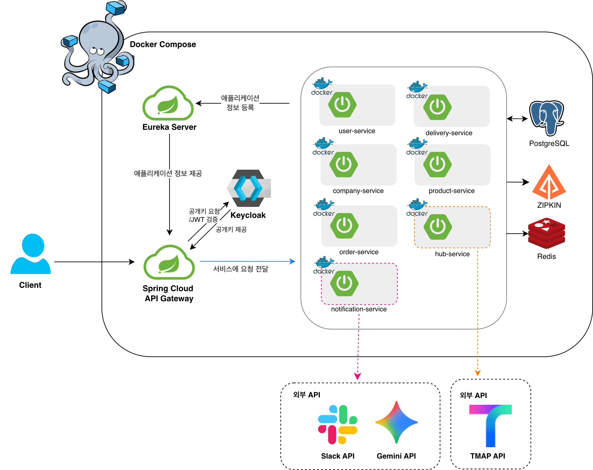

<div align="center">

# 🚚 럭키물류 (LuckyLogistics)

**허브 간 최적 경로 탐색부터 AI 발송 시한 계산까지**<br/>
Spring Cloud MSA 기반 B2B 물류 통합 관리 플랫폼

</div>

<br/>

## 📌 프로젝트 소개

스파르타 물류(럭키)는 전국 17개 허브 센터를 기반으로 B2B 기업 간 상품 배송을 관리하는 물류 통합 플랫폼입니다.

**MSA(Microservices Architecture)** 기반으로 설계되어 각 도메인(허브/업체/상품/주문/배송/알림)이 독립적인 서비스로 운영됩니다.

### ✨ 주요 특징

- 🔐 Spring Cloud Gateway 기반 **중앙 집중 인증/인가 처리**
- 🗺️ Dijkstra 알고리즘 + TMap API를 결합한 허브 간 **최적 배송 경로 자동 계산**
- ⚡ **Redis 캐싱**으로 허브 경로 조회 성능 최적화
- 🤖 **Gemini AI**를 활용한 납기일 기반 최종 발송 시한 자동 산출
- 💬 Slack WebAPI을 통한 허브 담당자 **실시간 주문 알림**
- 🔒 상품 재고 **낙관적 락(@Version)** 으로 동시 주문 시 재고 충돌 방지
- 📦 배송 담당자 타입(허브/업체)·상태 관리 및 **배송 단계별 상태 추적**
- 🔍 **Zipkin 분산 추적**으로 MSA 서비스 간 요청 흐름 모니터링

<br/>

## 👥 팀원

<table align="center">
  <tr>
    <td align="center" width="160">
      <br/>
      <b>이수빈</b> 👑<br/>
      <sub>팀장</sub><br/>
      <sub>주문 · 알림</sub><br/>
      <a href="https://github.com/LSLight">
        
      </a>
    </td>
    <td align="center" width="160">
      <br/>
      <b>곽정아</b><br/>
      <sub>팀원</sub><br/>
      <sub>허브 · 허브 경로</sub><br/>
      <a href="https://github.com/JungahGoak">
        
      </a>
    </td>
    <td align="center" width="160">
      <br/>
      <b>김진영</b><br/>
      <sub>팀원</sub><br/>
      <sub>Gateway · 유저</sub><br/>
      <a href="https://github.com/Jinyoung-Kim96">
        
      </a>
    </td>
    <td align="center" width="160">
      <br/>
      <b>박동진</b><br/>
      <sub>팀원</sub><br/>
      <sub>상품 · 업체 · Eureka</sub><br/>
      <a href="https://github.com/straycat405">
        
      </a>
    </td>
    <td align="center" width="160">
      <br/>
      <b>정성원</b><br/>
      <sub>팀원</sub><br/>
      <sub>배송 · 배송담당자</sub><br/>
      <a href="https://github.com/oharang">
        
      </a>
    </td>
  </tr>
</table>

<br/>

## 🛠 기술 스택

<table>
  <tr>
    <td align="center"><b>BackEnd</b></td>
    <td>
      
      
      
      
      
    </td>
  </tr>
  <tr>
    <td align="center"><b>Database</b></td>
    <td>
      
      
    </td>
  </tr>
  <tr>
    <td align="center"><b>MSA</b></td>
    <td>
      
      
      
    </td>
  </tr>
  <tr>
    <td align="center"><b>Infra & DevOps</b></td>
    <td>
      
      
      
      
    </td>
  </tr>
  <tr>
    <td align="center"><b>형상 관리</b></td>
    <td>
      
      
    </td>
  </tr>
  <tr>
    <td align="center"><b>외부 API</b></td>
    <td>
      
      
      
    </td>
  </tr>
</table>

<br/>

## 🏗 아키텍처



<br/>

## ⚙️ 서비스 구성

| 서비스 | 포트 | 설명 |
|--------|:----:|------|
| API Gateway | 19000 | JWT 인증/인가, 라우팅 |
| Eureka Server | 19090 | 서비스 디스커버리 |
| Hub Service | 19200 | 허브 및 허브 간 경로 관리 |
| Company Service | 19300 | 업체(공급자/수령자) 관리 |
| Product Service | 19400 | 상품 및 재고 관리 |
| Order Service | 19500 | 주문 생성 및 관리 |
| Delivery Service | 19600 | 배송 담당자 및 배송 관리 |
| Notification Service | 19700 | AI 발송 시한 계산 및 Slack 알림 |

<br/>


## 🚀 로컬 실행 방법

**사전 조건**: Docker, Docker Compose 설치

```bash
# 환경 변수 설정
cp .env.example .env

# 실행
docker-compose up -d
```
